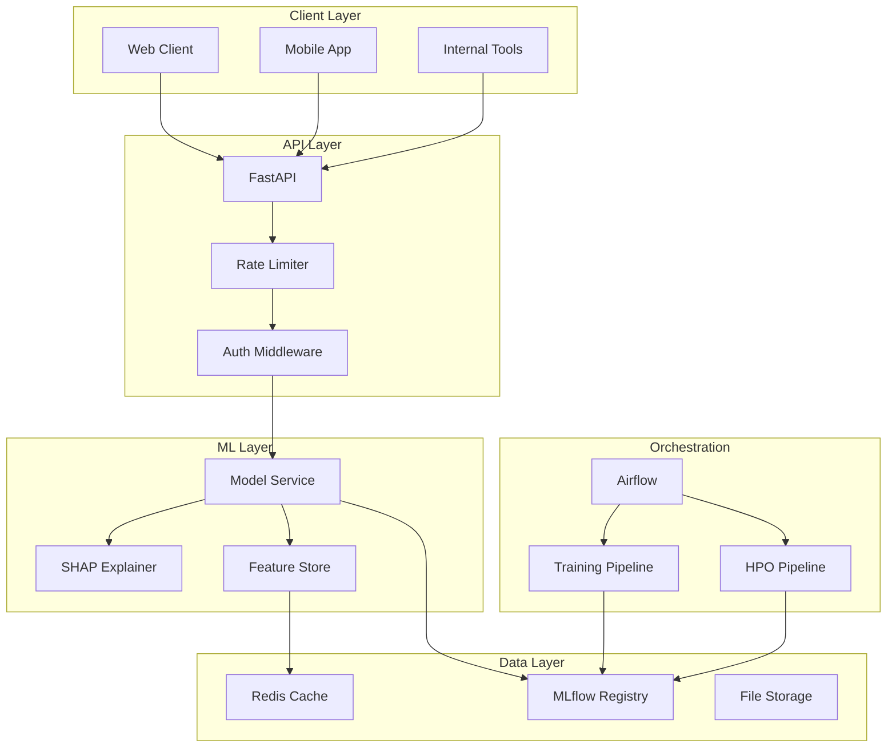
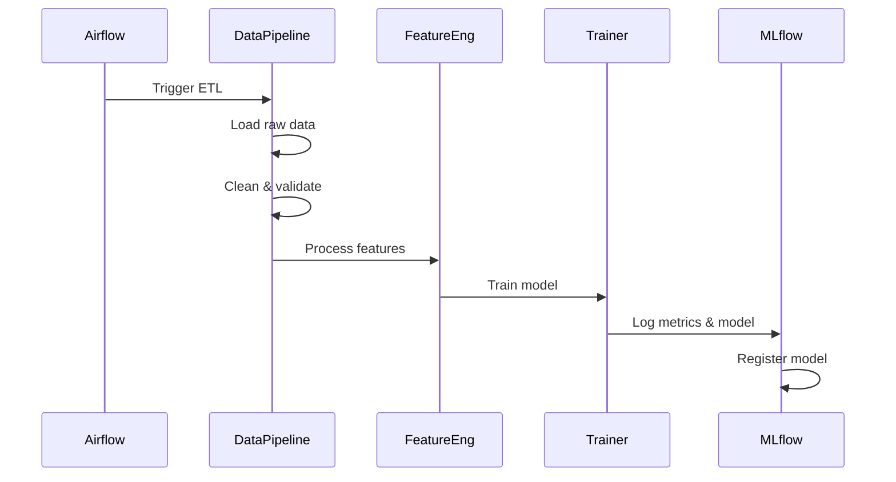
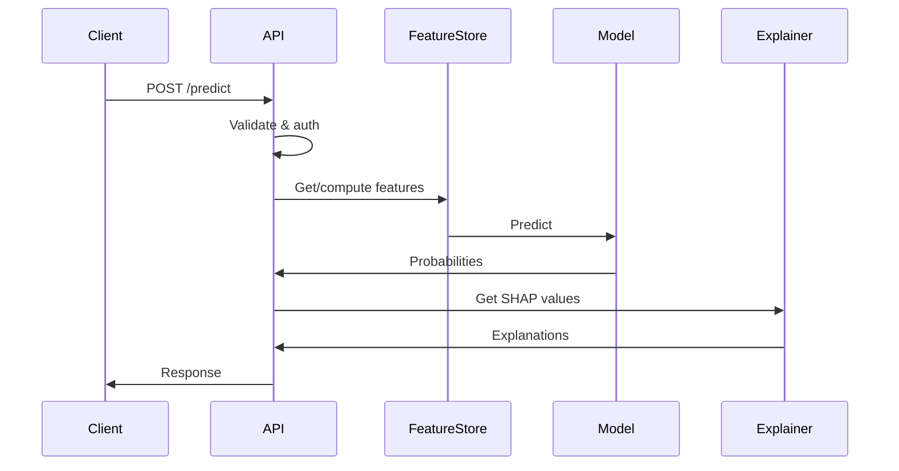

# Architecture Overview

## System Architecture



## Components

### API Layer

**FastAPI Application** (`src/api/`)

- REST endpoints for predictions and explanations
- Pydantic schemas for validation
- Rate limiting (Redis-backed)
- API key authentication
- Prometheus metrics

### ML Layer

**Model Service** (`src/models/`)

- Model loading from MLflow or local files
- Prediction with confidence scores
- SHAP-based explanations
- Batch processing

**Feature Engineering** (`src/features/`)

- Feature preparation and transformation
- Feature store with Redis caching
- Data validation with Pandera

### Data Layer

**Data Processing** (`src/data/`)

- Raw data loading (CSV)
- Event aggregation
- Train/test splitting
- Churn label generation

### Orchestration

**Airflow DAGs** (`dags/`)

- `etl_pipeline` - Daily data processing
- `training_pipeline` - Weekly model training
- `hpo_pipeline` - Hyperparameter optimization
- `batch_inference` - Daily batch predictions

## Data Flow

### Training Flow



### Inference Flow



## Deployment Architecture

### Development

```
┌─────────────────────────────────────────┐
│             Docker Compose              │
├─────────┬─────────┬─────────┬──────────┤
│   API   │ MLflow  │ Airflow │  Redis   │
│  :8000  │  :5000  │  :8080  │  :6379   │
└─────────┴─────────┴─────────┴──────────┘
```

### Production

```
┌─────────────────────────────────────────────────────┐
│                   Load Balancer                     │
└─────────────────────┬───────────────────────────────┘
                      │
┌─────────────────────┼───────────────────────────────┐
│                     │                               │
│  ┌──────────┐  ┌────┴─────┐  ┌──────────┐          │
│  │ API Pod  │  │ API Pod  │  │ API Pod  │          │
│  └────┬─────┘  └────┬─────┘  └────┬─────┘          │
│       │             │             │                 │
│       └─────────────┼─────────────┘                 │
│                     │                               │
│  ┌──────────────────┼──────────────────────────┐   │
│  │                  │      Shared Services      │   │
│  │   ┌──────────┐   │   ┌──────────┐           │   │
│  │   │  Redis   │   │   │  MLflow  │           │   │
│  │   │ Cluster  │   │   │  Server  │           │   │
│  │   └──────────┘   │   └──────────┘           │   │
│  │                  │                           │   │
│  └──────────────────┴───────────────────────────┘   │
│                                                     │
└─────────────────────────────────────────────────────┘
```

## Technology Stack

| Layer | Technology |
|-------|------------|
| API | FastAPI, Pydantic, uvicorn |
| ML | scikit-learn, LightGBM, XGBoost, SHAP |
| MLOps | MLflow, Airflow, DVC |
| Cache | Redis |
| Monitoring | Prometheus, Grafana |
| Logging | structlog |
| Container | Docker |
