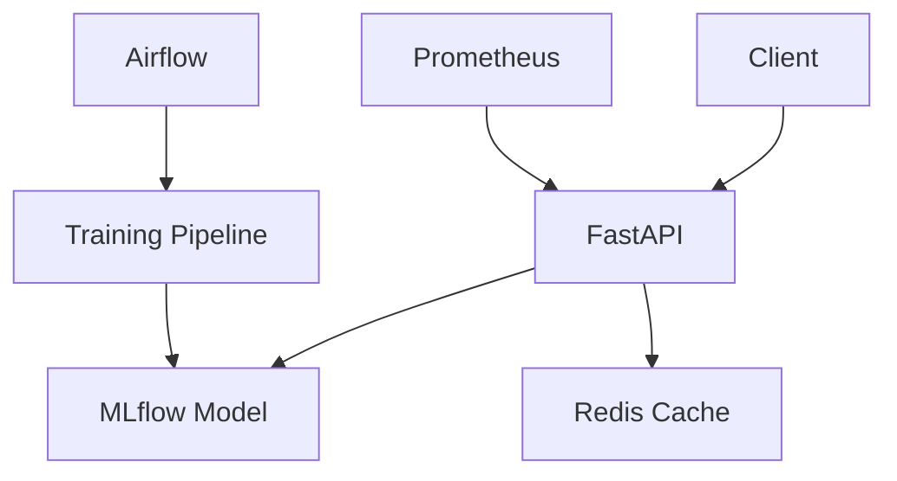

# Churn Radar

**ML Platform for Customer Churn Prediction**

Churn Radar is a production-ready machine learning platform for predicting customer churn. Built with modern MLOps practices, it provides end-to-end capabilities from data processing to model deployment.

## Features

- **FastAPI** - High-performance REST API
- **MLflow** - Model versioning and experiment tracking
- **Airflow** - Orchestrated ML pipelines
- **Prometheus** - Metrics and monitoring
- **SHAP** - Model explainability
- **Redis** - Feature caching and rate limiting

## Quick Start

```bash
# Clone repository
git clone https://github.com/yourname/churn-radar.git
cd churn-radar

# Setup environment
python -m venv .venv && source .venv/bin/activate
pip install -r requirements.txt

# Start services
docker compose up -d

# Train demo model
make train-demo

# Start API
make api
```

## Architecture



## Documentation Structure

- **Getting Started** - Installation, configuration, and quick start guide
- **User Guide** - Detailed usage instructions for each component
- **Architecture** - System design and component overview
- **API Reference** - Complete API documentation
- **Development** - Contributing guidelines and development setup

## Links

- [GitHub Repository](https://github.com/yourname/churn-radar)
- [API Documentation](http://localhost:8000/docs)
- [MLflow UI](http://localhost:5000)
- [Airflow UI](http://localhost:8080)
